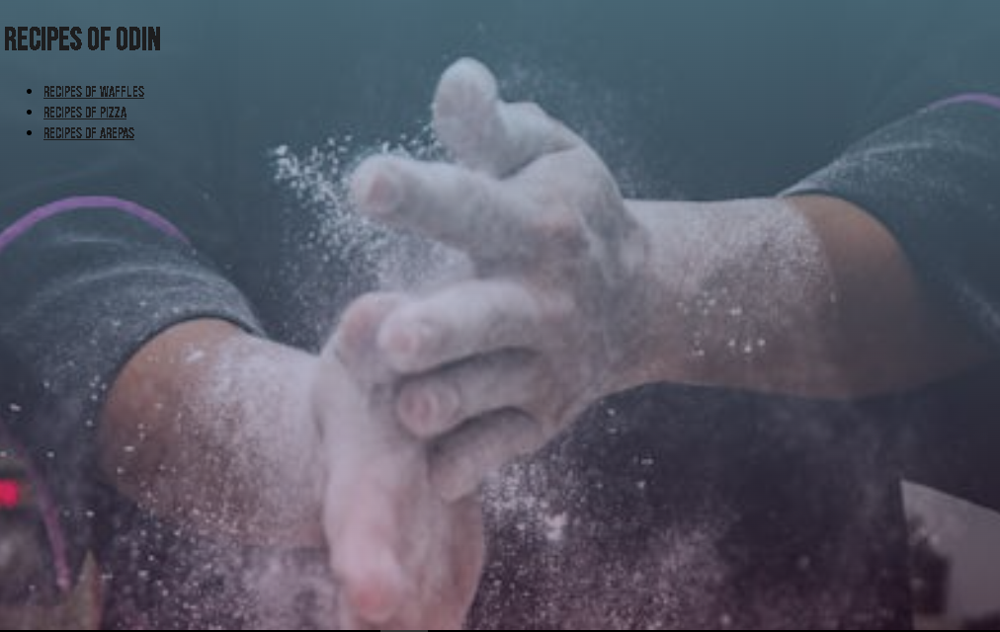

# Odin Recipes

> This project is based on cooking recipes for the home.

      

## Built With

- Major languages
- Frameworks
- Technologies used

## Live Demo

[Live Demo Link]( https://jokerjaas2002.github.io/odin-recipes/)

## Getting Started

**To start this code you must first clone the odin-recipes git repository, then create a new directory and open it with git bash. In git bash enter your username and email, then run the code command. To enter the Visual Studio Code text editor, inside modify your code to your liking and then upload it to a new repository in your account. To finish, upload it to the web.**

To get a local copy up and running follow these simple example steps.

### Prerequisites

### Setup

### Install

### Usage

### Run tests

### Deployment

## Authors

👤 **JOEL ANDRES ACOSTA SENTENO**

- GitHub: [@jokerjaas2002](https://github.com/aristides1000)

🤝 Contributing
Contributions, issues, and feature requests are welcome!

Feel free to check the
[issues page](../../isuues/).

## Show your support

Give a ⭐️ if you like this project!

## Acknowledgments

- Hat tip to anyone whose code was used
- Inspiration
- etc

## 📝 License

This project is [CC0 1.0 Universal](LICENSE) licensed.
